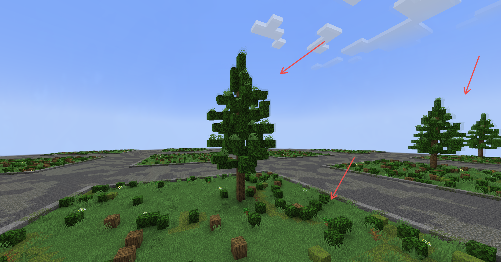
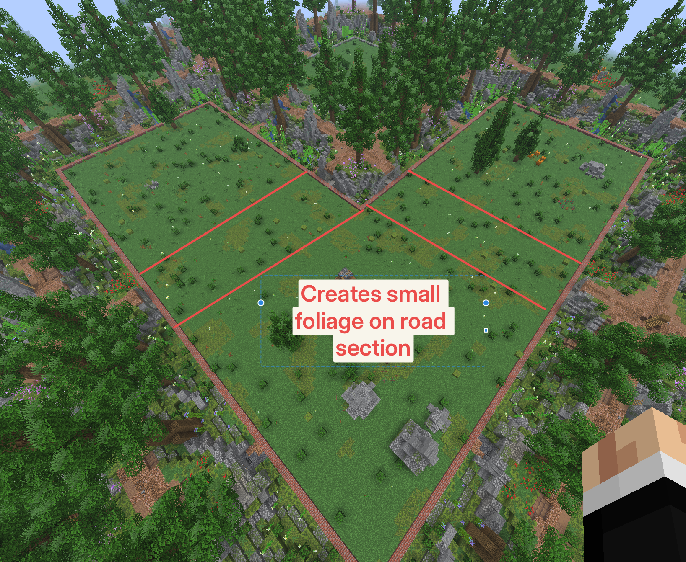

# Modifications
> Specifically made for the usage on totorix.net, so it might not fit on your server.

The world generator has been extended with a foliage decoration system that places
schematics and ground vegetation on plots. Everything it places is derived from a hash of the
block's world coordinates, so a chunk looks identical no matter when or in what order it is
generated — across chunk boundaries, server restarts and plot resets alike.

<p align="center">
    
</p>

### Schematics

Drop `.schem` files into the category folder you want them to appear in:

```
plugins/PlotSquared/schematics/<category>/*.schem
```

Each category has its own spawn chance and a cap on how many instances may appear on one plot.
Both are hardcoded in `SchematicDecorator#loadCategories`:

| Category       | Chance per attempt | Max per plot |
|----------------|-------------------:|-------------:|
| `busch`        |               50% |            4 |
| `stein`        |             ~39%  |            4 |
| `tree`         |               25% |            3 |
| `stein_medium` |             ~20%  |            3 |
| `wall`         |             ~20%  |            2 |
| `hill`         |             ~15%  |            1 |
| `haus`         |             ~12%  |            1 |
| `kleinkram`    |             ~12%  |            2 |
| `stein_big`    |             ~10%  |            2 |
| `steinkreis`   |              ~6%  |            1 |

A category rolls once per allowed instance, so `tree` at 25% / 3 averages a little under one
tree per plot. Chances are stored as a value out of 256 (`hash & 0xFF < spawnChance`).

A category whose largest schematic does not fit inside the plot is skipped outright, and folders
that are missing or empty are simply ignored — you do not have to fill all ten.

Schematics are anchored to the plot cell. That is what makes a plot reset restore exactly the
layout it was generated with, and it is why merging plots never rearranges them.

### Ground vegetation

`FoliageDecorator` fills the layer directly above `PLOT_HEIGHT` from a weighted palette:

```
60% air, 20% short_grass, 3% fern, 2% oak_leaves[persistent=true],
1% azure_bluet, 0.5% dead_bush, 0.5% dark_oak_sapling, 0.2% azalea
```

The numbers are relative weights, not absolute probabilities — they are normalised over their
sum (87.2), so roughly 69% of columns actually stay empty. Where the plot schematic already
occupies the column, it wins and no foliage is written.

### Plot reset and merge behaviour

Clearing, deleting or merging a plot re-applies the decorators, so the result looks like freshly
generated terrain instead of a bare `TOP_BLOCK` surface. Merging additionally grows foliage over
the reclaimed road strip.



> Note: on hybrid worlds the clear deliberately bypasses FastAsyncWorldEdit's
> `RegionManager#handleClear`, because its delegate does not know about the decorators and would
> leave the plot bare. Blocks still go through the `QueueCoordinator`, which FAWE provides.
> `Settings.Enabled_Components.FAWE_HOOK.CLEAR` therefore has no effect on hybrid worlds.

<p align="center">
    
</p>

---

PlotSquared is a land and world management plugin for Minecraft.
It includes several highly configurable world generators.
You can create plots of land in existing worlds using plot clusters, or you can have a full world of plots.

For the end user, PlotSquared is packed with a tonne of cool features.
It allows you to merge plots, and build together with your friends.
You can also change a lot of plot specific settings in the form of
flags. Such as: weather, time, game modes, pvp status.

Whilst we provide a whole load of unique features, the biggest focus
is to provide a lag-free and smooth experience.


<p align="center">
    <a href="https://bstats.org/plugin/bukkit/PlotSquared" title="PlotSquared on bStats">
        
    </a>
</p>

## Links

* [Download](https://www.spigotmc.org/resources/77506/)
* [Discord](https://discord.gg/intellectualsites)
* [Wiki](https://intellectualsites.gitbook.io/plotsquared/)
* [Issues](https://github.com/IntellectualSites/PlotSquared/issues)
* [Translations](https://intellectualsites.crowdin.com/plotsquared/)
* [Contributing](https://github.com/IntellectualSites/.github/blob/main/CONTRIBUTING.md)

### Developer Resources

* [API Documentation](https://intellectualsites.gitbook.io/plotsquared/api/api-documentation)
* [Event API](https://intellectualsites.gitbook.io/plotsquared/api/event-api)
* [Flag API](https://intellectualsites.gitbook.io/plotsquared/api/flag-api)

# Official Addons

* [Plot2Dynmap](http://www.spigotmc.org/resources/plot2dynmap.1292/)
* [HoloPlots](https://www.spigotmc.org/resources/holoplots.4880/)
* [PlotHider](https://www.spigotmc.org/resources/plot-hider.20701/)

### Edit The Code

Want to add new features to PlotSquared or fix bugs yourself? You can get the game running, with PlotSquared, from the code here:

For additional information about compiling PlotSquared,
see [CONTRIBUTING.md](https://github.com/IntellectualSites/.github/blob/main/CONTRIBUTING.md)

### Submitting Your Changes

PlotSquared is open source (specifically licensed under GPL v3), so note that your contributions will also be open source. The
best way to submit a change is to create a fork on GitHub, put your changes there, and then create a "pull request" on our
PlotSquared repository.

<a href="https://yourkit.com/">
    
</a>

Thank you to YourKit for supporting our product by providing us with their innovative and intelligent tools
for monitoring and profiling Java and .NET applications.
YourKit is the creator
of [YourKit Java Profiler](https://www.yourkit.com/java/profiler/), [YourKit .NET Profiler](https://www.yourkit.com/.net/profiler/),
and [YourKit YouMonitor](https://www.yourkit.com/youmonitor/).
